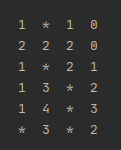
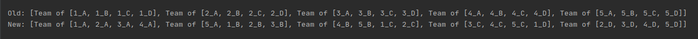
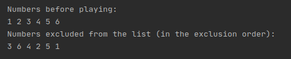

# Algorithmic-exercises-Java
Set of smaller assignments aiming at improving algorithmic skills. Each exercise is held in different package, described separately and tested.
## Table of all exercises:
* **Minesweeper** - generating board, adding mines to it and calculating the points value for remaining fields.

* **Team reshuffle** - algorithm aiming at generating new members for teams to shuffle students between teams.

* **Tinker Tailor** - imitation of the children's game of excluding member from a group each time the rhyming poem ends.

* **Optimus Prime** - sieve of Eratosthenes; simple, an ancient algorithm for finding all prime numbers up to any given limit

* **Merge sort** - an efficient, general-purpose, comparison-based sorting algorithm. Merge sort is a divide and conquer algorithm that was invented by John von Neumann in 1945. 
